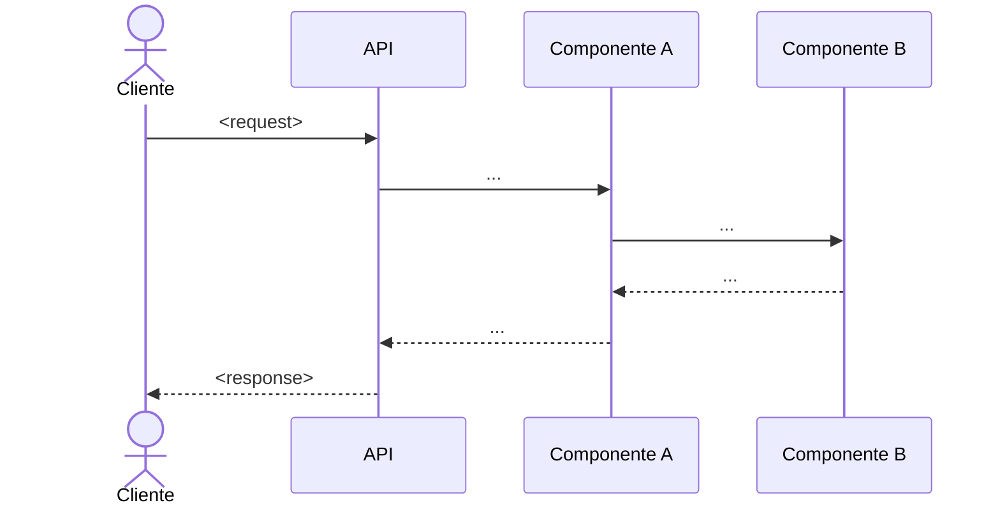

# Template — `FW-06_design.md` de una story

> **Para qué:** decisiones técnicas que **satisfacen** la SDD. Librerías, wrappers, capas, patterns, estructura de archivos.
> **Usado por:** `/fremi-story`, Paso 4 (crear archivo).
> **Rol del archivo:** **cómo ESTRUCTURAL** — tecnologías elegidas, componentes internos, contratos internos derivados.
> **Antes de:** `FW-07_tdd-plan.md`. El TDD se planea contra esta estructura.
> **Frontera crítica (Regla 6.4):** acá NO se redefine la SDD. Si una decisión de Design contradice o expande la SDD → mover a SDD primero (o crear ADR si es una bifurcación) y después diseñar.
> **NO es UI/UX.** Para diseño visual referenciar Figma/wireframes desde un link externo.
>
> **Concreción del código:** preferí firmas TypeScript reales (types, funciones, schemas Zod) sobre pseudocódigo abstracto. El design debe ser suficientemente concreto para que la implementación (`/apply`) sea mecánica, no interpretativa. Reservá pseudocódigo sólo para algoritmos abstractos donde el detalle sintáctico distrae.

---

```markdown
---
version: 1.0.0
created: YYYY-MM-DD
last_updated: YYYY-MM-DD
doc_type: snapshot
ancestor:
  id: {feature_id}
  version_at_creation: "<versión actual de FT-XX/definition.md>"
  version_at_closure: null
---

# Diseño técnico

> Decisiones técnicas que satisfacen los contratos de `FW-05_sdd-spec.md`. Nada acá redefine el contrato externo — sólo cómo se cumple internamente.

## Tecnologías y librerías elegidas

| Capa / responsabilidad | Tecnología/lib | Versión | Justificación / ADR |
|---|---|---|---|
| <ej: Generación de PDF> | Puppeteer + @sparticuz/chromium | ^21.x | Aplica ADR-002 |
| <ej: HTTP runtime> | AWS Lambda + API Gateway | Node 20 | Aplica ADR-001, ADR-003 |
| ... | ... | ... | ... |

## Componentes / módulos internos

> Cada componente con su responsabilidad. Pensar en términos de "qué hace", no "qué archivo es".

- **`<Componente A>`** — <responsabilidad en 1 línea>
- **`<Componente B>`** — <responsabilidad>
- **`<Componente C>`** — <responsabilidad>

## Wrappers / adaptadores

> Si se envuelve una librería detrás de una interfaz interna (para testing, swapping, abstracción) → declararla acá. Si la librería se usa directo → mencionarlo también explícitamente.

- **`<NombreAdapter>`** — envuelve `<librería>`. Justificación: <test seam | abstracción | otra>.

## Contratos internos (módulo a módulo)

> Firmas que existen **porque ya se eligió X librería/estructura**. No confundir con SDD (contratos externos).

### `<Componente A> → <Componente B>`

```
<firma o pseudocódigo de la interfaz interna>
```

## Diagrama de secuencia

> Mermaid o descripción equivalente. Mostrar el caso feliz principal de extremo a extremo.



## Modelo de datos (si aplica)

> Tablas / colecciones / schemas internos. Si no hay persistencia, escribir "N/A — story stateless".

- <tabla/colección>: <campos relevantes>
- (o referencia a `prisma/schema.prisma`, `migrations/`, etc.)

## Pseudocódigo de algoritmos clave

> Sólo para algoritmos no triviales. Si la lógica es directa, omitir esta sección.

```
function generarReporte(input):
  ...
```

## Patrones aplicados

- <patrón>: <dónde y por qué>
- <ej: "Adapter pattern para GraphQL client — aislamos el SDK detrás de `GraphQLAdapter` para poder mockear en tests">

## Manejo de errores internos

> Cómo se propagan los errores entre módulos (excepciones, Result types, tagged unions, etc.). Cómo se mapean a los códigos expuestos en `FW-05_sdd-spec.md`.

- <regla 1>
- <regla 2 — ej: "GraphQLError de la query principal se traduce a 502 al consumidor con body `{ error: 'upstream_error' }`">

## Concurrencia / transacciones (si aplica)

- <regla 1>
- <ej: "Lambda procesa una request a la vez — sin estado compartido entre invocaciones">

## Estructura de archivos a crear

```
src/
├── lambda/
│   ├── handler.ts                  ← entrypoint
│   └── handler.test.ts             ← tests handler
├── pdf/
│   ├── PdfGenerator.ts             ← componente A
│   ├── PdfGenerator.test.ts
│   └── ChromiumLauncher.ts         ← wrapper de @sparticuz/chromium
├── graphql/
│   └── GraphQLAdapter.ts           ← adaptador
└── shared/
    └── errors.ts
```

## Key Invariants

> 2-3 bullets con las invariantes que la implementación NO debe romper.
> Es el "resumen ejecutivo" del diseño — si alguien no lee el resto, esto sí.
> Cada invariante debe ser una afirmación concreta que un test pueda verificar.

- <ej: "El helper `buildTicketsFilters` devuelve RAW (sin URL-encode). El servicio hace exactamente UN pass de encoding vía `URLSearchParams`.">
- <ej: "El adaptador `useTicketsListAdapter` no cambia de signature — sin nuevas dependencies, sin extra params.">
- <ej: "Ninguna decisión de este design contradice la SDD; si contradice → volver a FW-05 y actualizar contrato primero (Regla 6.4).">

## Edge Cases Pin-Down

> Casos borde ambiguos identificados durante el diseño, cada uno con referencia
> al requirement de la SDD que lo cubre. Estos son los "gotchas" que van a doler
> si no se piensan ahora. Sin esta sección, los edge cases quedan sueltos entre
> design y TDD, y aparecen recién en producción.

### <R-XX> — <nombre del caso borde>
- **Ambigüedad**: <qué no está claro sin este pin>
- **Decisión**: <cómo se resuelve — concreta y verificable>
- **Aplica ADR**: <ADR-XXX si corresponde; si es táctica local sin bifurcación, dejar "N/A — decisión local">
- **Test que lo captura**: <referencia a TC-XXX que va a nacer en FW-07>

### <R-YY> — <otro caso borde>
- **Ambigüedad**: …
- **Decisión**: …
- **Aplica ADR**: …
- **Test que lo captura**: …

## Open Questions

> Dudas técnicas NO resueltas al momento del design. **Deben cerrarse antes de
> `FW-07_tdd-plan.md`** — o aceptarse explícitamente como **Known Limitation**
> transferida al `FW-02_proposal.md`. NO se arrastran en silencio a la
> implementación.

- [ ] <duda 1 — quién la resuelve y cuándo>
- [ ] <duda 2>
- [ ] <duda 3>

**Si quedan open questions al terminar el design → NO avanzar a FW-07.** Cerrar las dudas primero (consulta al usuario, spike técnico, decisión + ADR).

## Acceptance Test Mapping (forward)

> Matriz **forward** de requirement SDD → test planeado. Alimenta directamente
> el `FW-07_tdd-plan.md`. Es el puente forward — la matriz backward completa
> (con test verde + archivo de código) vive en `FW-10_closure.md`.

| Requirement (SDD) | Test planeado (TC-XXX) | Archivo esperado |
|---|---|---|
| <R1> | TC-001 | <ruta esperada, ej: `src/pdf/PdfGenerator.test.ts::should render PDF from valid HTML`> |
| <R2> | TC-002 | <ruta> |
| <R3> | TC-003, TC-004 | <rutas> |
| … | … | … |

**Cobertura esperada al cerrar el design**: cada requirement de SDD debe tener al menos un TC-XXX planeado. Si algún requirement queda sin test → gap del design; volver a completarlo.
```

---

## Reglas de uso

1. **Toda librería elegida tiene justificación.** Si elegiste lib X "porque sí", probablemente había una bifurcación → ADR (Regla 3b).
2. **No redefinir el contrato externo.** Si Design contradice SDD, hay un error de orden: o se actualiza SDD primero (con sync-back) o el Design está mal.
3. **Mostrar el caso feliz end-to-end.** El diagrama de secuencia es la mejor manera de validar que el diseño responde a la story completa.
4. **Estructura de archivos al final, no al principio.** Los archivos derivan de los componentes — no al revés.
5. **ADRs por bifurcación (Regla 3b).** Cualquier decisión con 2+ caminos viables → pausar y `/fremi-story-adr` antes de cerrar el Design.
6. **Wrappers sólo cuando aportan.** Envolver una lib "por las dudas" agrega ruido. Envolverla porque necesitás test seam, abstracción real o swapping futuro tiene sentido.
7. **Key Invariants concretos y verificables.** Si una invariante no se puede validar con un test o inspección, es una aspiración, no una invariante.
8. **Edge Cases con ID de requirement.** Cada caso borde referencia el R-XX de SDD que cubre. Los edge cases sin requirement asociado son señal de gap en SDD (Regla 6).
9. **Open Questions se resuelven ANTES de FW-07.** No arrastrar dudas técnicas silenciosamente a la implementación — o se cierran, o se documentan como Known Limitation en `FW-02_proposal.md`.
10. **Acceptance Test Mapping cubre 100% de requirements.** Cada R-XX de SDD debe tener TC-XXX asociado. Si un requirement queda sin test planeado, el design está incompleto.
